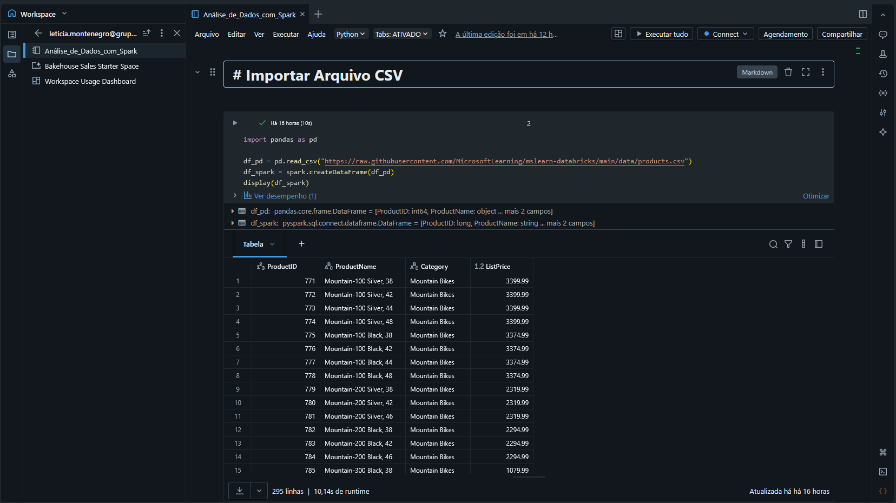
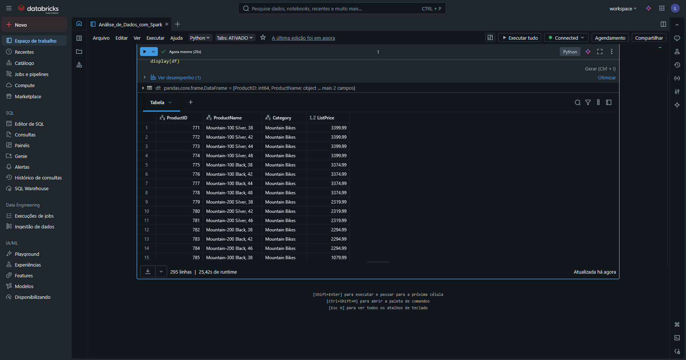
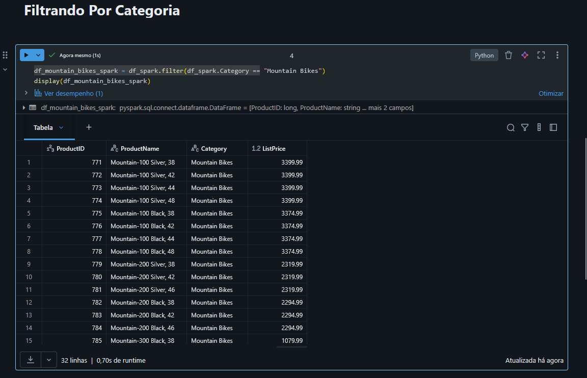

##  Projeto: Controle e Versionamento de Código no Notebook da Azure

###  Descrição

Este projeto faz parte do desafio **"Controle e Versionamento de Código no Notebook da Azure"** da plataforma **DIO (Digital Innovation One)**.
O objetivo foi explorar o ambiente do **Azure Databricks**, criar um **notebook em Pandas** e realizar operações de **análise e filtragem de dados com o Apache Spark**.

Durante a prática, foi realizado um filtro para selecionar apenas os produtos da categoria **"Mountain Bikes"** e visualizar as informações principais, como *ProductID*, *ProductName*, *Category* e *ListPrice*.

---

###  Objetivo do Projeto

* Criar e executar um **notebook Python** dentro do **Azure Databricks**;
* Praticar comandos básicos de análise com **Apache Spark**;
* Entender o processo de filtragem de dados com DataFrames;
* Versionar o projeto no **GitHub** para compor o portfólio técnico.

---

###  Tecnologias Utilizadas

* **Microsoft Azure**
* **Azure Databricks**
* **Apache Spark**
* **Python (pandas e pyspark)**
* **Git e GitHub**

---

###  Etapas Realizadas

1. Criação do workspace no Azure Databricks;
2. Abertura de um notebook Python;
3. Carregamento do dataset products.csv hospedado no GitHub;
4. Conversão de pandas DataFrame para Spark DataFrame;
5. Aplicação de filtro para a categoria "Mountain Bikes";
6. Visualização dos resultados e registro no GitHub.

---

###  Ajuste Técnico Importante

Durante a execução, foi identificado um problema na visualização dos dados em formato gráfico, pois o Databricks Serverless não permite acesso direto ao sistema de arquivos local do cluster.

Para contornar essa limitação e garantir a correta visualização dos dados:

O dataset foi carregado inicialmente como um pandas DataFrame;

Em seguida, foi convertido para um Spark DataFrame, permitindo aproveitar o poder de processamento distribuído do cluster e a visualização nativa do Databricks (otimizada para Spark).

```Pandas
# IMPORTANDO ARQUIVO CSV EM PANDAS CONVERTE PARA SPARK "
import pandas as pd

df_pd = pd.read_csv("https://raw.githubusercontent.com/MicrosoftLearning/mslearn-databricks/main/data/products.csv")
df_spark = spark.createDataFrame(df_pd)
display(df_spark)

# Filtrando apenas produtos da categoria "Mountain Bikes"

df_mountain_bikes_spark = df_spark.filter(df_spark.Category == "Mountain Bikes")
display(df_mountain_bikes_spark)display(df_mountain_bikes)
```

---

### 📊 Resultado

A consulta retornou os produtos da categoria **Mountain Bikes**, exibindo informações como *ProductID*, *ProductName*, *Category* e *ListPrice*.

| ProductID | ProductName             | Category       | ListPrice |
| --------- | ----------------------- | -------------- | --------- |
| 771       | Mountain-100 Silver, 38 | Mountain Bikes | 3399.99   |
| 772       | Mountain-100 Silver, 42 | Mountain Bikes | 3399.99   |
| ...       | ...                     | ...            | ...       |

---

### 📸 Evidências do Projeto

📌 **1️⃣ Notebook criado e executado no Azure Databricks**

> Mostra o notebook com o DataFrame carregado e a execução do código Python.
> 

📌 **2️⃣ Importando Aquivo Cvs e Converter para Spark”**

> Exibe o resultado  da importação do Csv .
> 

📌 **3️⃣ Filtragem dos produtos da categoria “Mountain Bikes”**

> Exibe o resultado do filtro aplicado no DataFrame com os produtos e preços listados.
> 

---

### Insights e Aprendizados

Aprendi sobre a diferença entre pandas e Spark DataFrames e quando cada um é mais adequado.
Entendi como o Databricks Serverless gerencia o acesso ao sistema de arquivos e por que a conversão para Spark é necessária.
Explorei a visualização nativa do Databricks, que é mais eficiente e interativa com Spark.
Reforcei a importância de versionar notebooks e documentar as decisões técnicas no processo.

---


